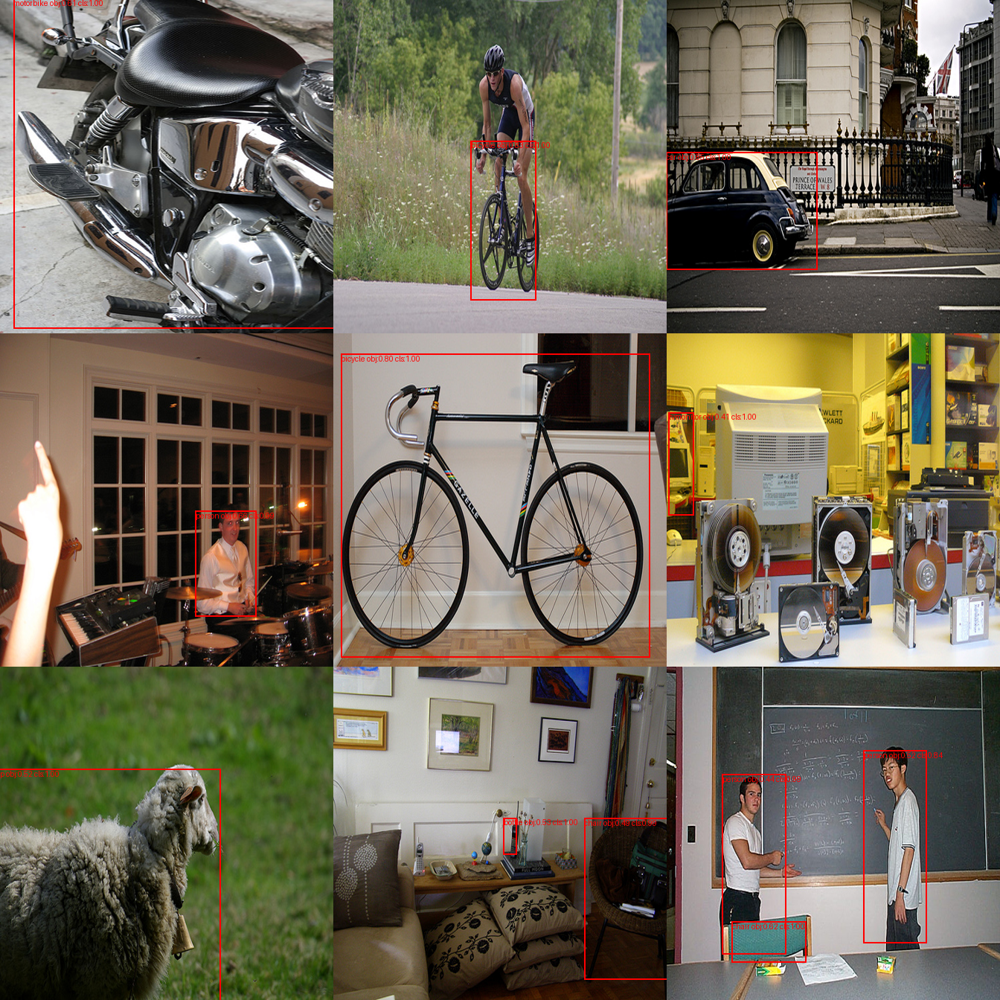
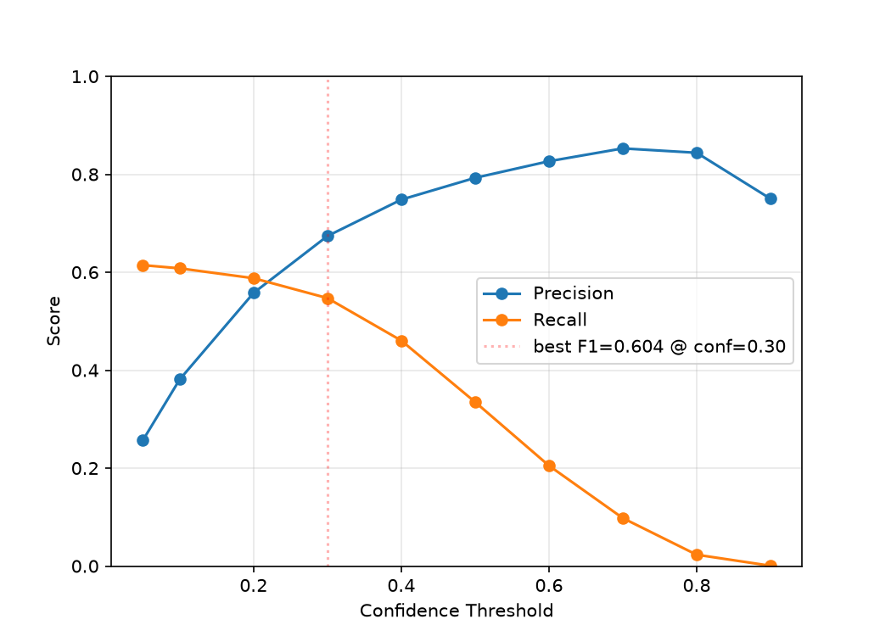

# MyTinyDetector
It just my tiny object detection model

## Setup
### init
* Copy 'config_example.yaml' to 'config.yaml'
* Init project  
      ```
      uv sync
      ```
* Train  
      ```
      uv run train.py
      ```
* Test/Eval  
      ```
      uv run test.py
      ```  
      ```
      uv run eval.py
      ```

## Model Structure
```
Input Image
B × 3 × H × W
      │
      ▼
┌─────────────────────┐
│   ConvNeXt-Tiny     │
│      Backbone       │
│                     │
│   stride = 32       │
└─────────────────────┘
      │
      │ B × 768 × H/32 × W/32
      ▼
┌─────────────────────┐
│    Detection Head   │
│                     │
│ Conv 3×3            │
│ 768 → 256           │
│                     │
│ DropBlock           │
│                     │
│ Conv 3×3, stride=2  │
│ 256 → 256           │
│                     │
│ Conv 1×1            │
│ 256 → 5 + C         │
└─────────────────────┘
      │
      │ B × (5 + C) × H/64 × W/64
      ▼
┌─────────────────────┐
│    Decode + NMS     │
└─────────────────────┘
      │
      ▼
Detections
```

## Dataset
| Split | Dataset           | Subset   | Images |
| :---: | ----------------- | -------- | -----: |
| Train | VOC2007 + VOC2012 | trainval | 16,551 |
|  Test | VOC2007           | test     |  4,952 |

* Train = VOC2007 trainval + VOC2012 trainval
* Test = VOC2007 test
* Classes = 20
* Input Size = 448 × 448


## Config

| Category | Parameter | Value |
|:--------:|-----------|:-----:|
| Data | Input Size | 448 × 448 |
|      | Effective Batch Size | 32 |
| Model | Backbone | ConvNeXt-Tiny |
|      | Pretrained | ImageNet-1K |
| Optimization | Optimizer | AdamW |
|            | Learning Rate | 1e-4 |
|            | Weight Decay | 5e-4 |
|            | Backbone LR | 1e-5 |
| Schedule | Backbone Freeze | 3 epochs |
|          | Warmup | 5 epochs |
|          | Warmup Start Factor | 0.1 |
|          | Scheduler | Linear Warmup + Cosine Annealing |
| Training | Epochs | 100 |
* Effective Batch Size = (Mini-batch) × (Accumulation Steps) = 16 × 2 = 32

## Loss Function

$`\Large \mathcal{L}_{\text{total}} = \mathcal{L}_{\text{obj}} + \mathcal{L}_{\text{cls}} + \lambda_{\text{coord}}\mathcal{L}_{\text{box}}`$

where 
* $\mathcal{L}\_{\text{obj}} = \text{FocalLoss}(o,\hat{o};\alpha=0.25,\gamma=2.0)$
* $\mathcal{L}\_{\text{box}} = \text{MSE}([t_x,t_y,\sqrt{w},\sqrt{h}],[\hat{t}_x,\hat{t}_y,\sqrt{\hat{w}},\sqrt{\hat{h}}])$
* $\mathcal{L}\_{\text{cls}} = \text{MSE}(\mathbf{p},\hat{\mathbf{p}})$
* $\lambda\_{\text{coord}} = 3.0$


## Results

### Test 
* with 16 randomly selected images from the VOC2012 testset


### PR
* with validation images from VOC2007 testset

